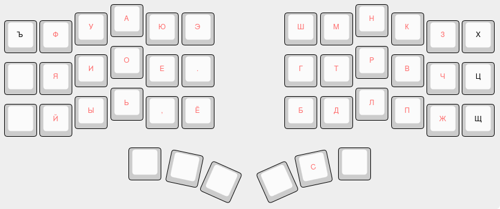
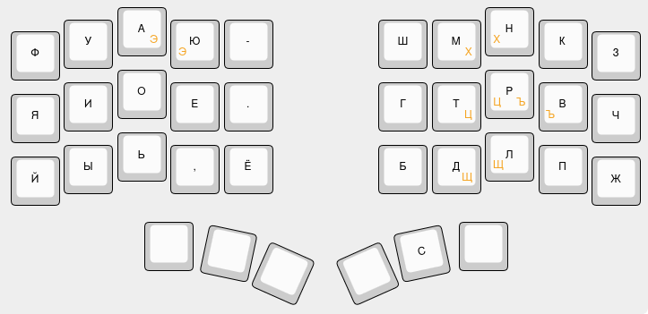
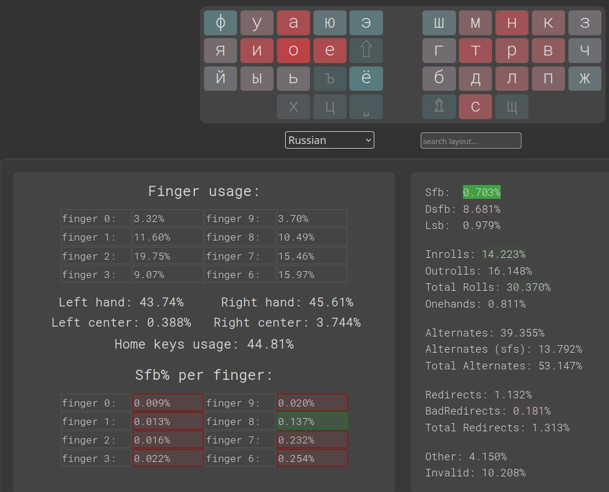
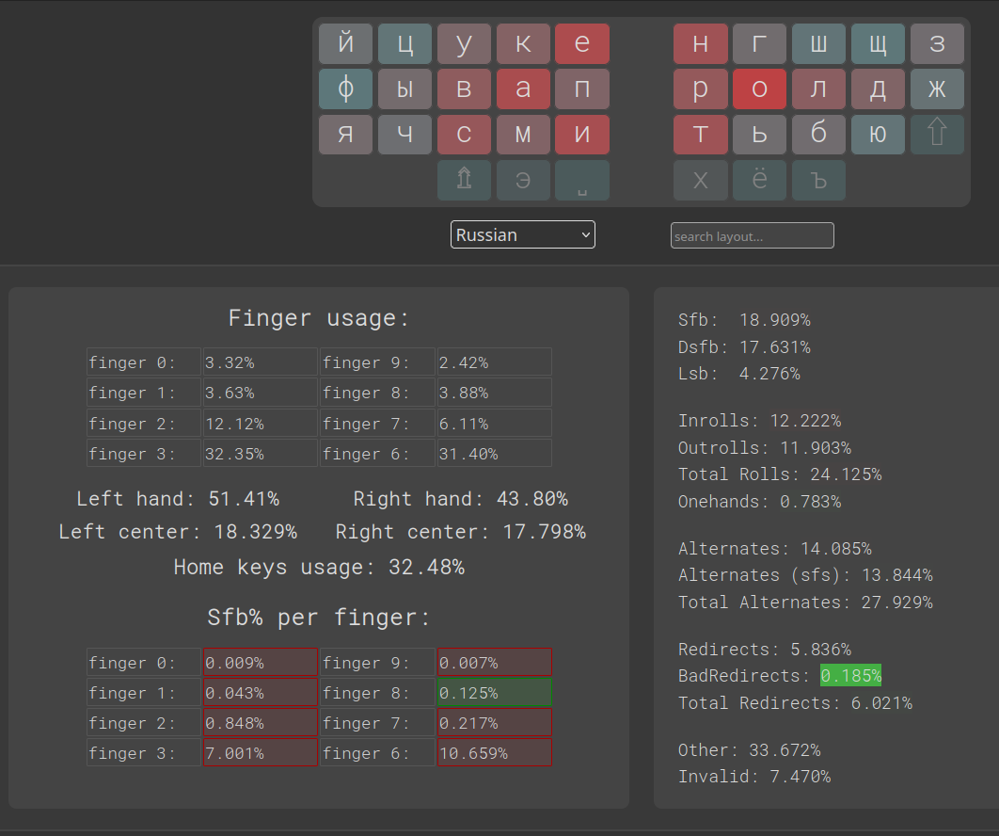
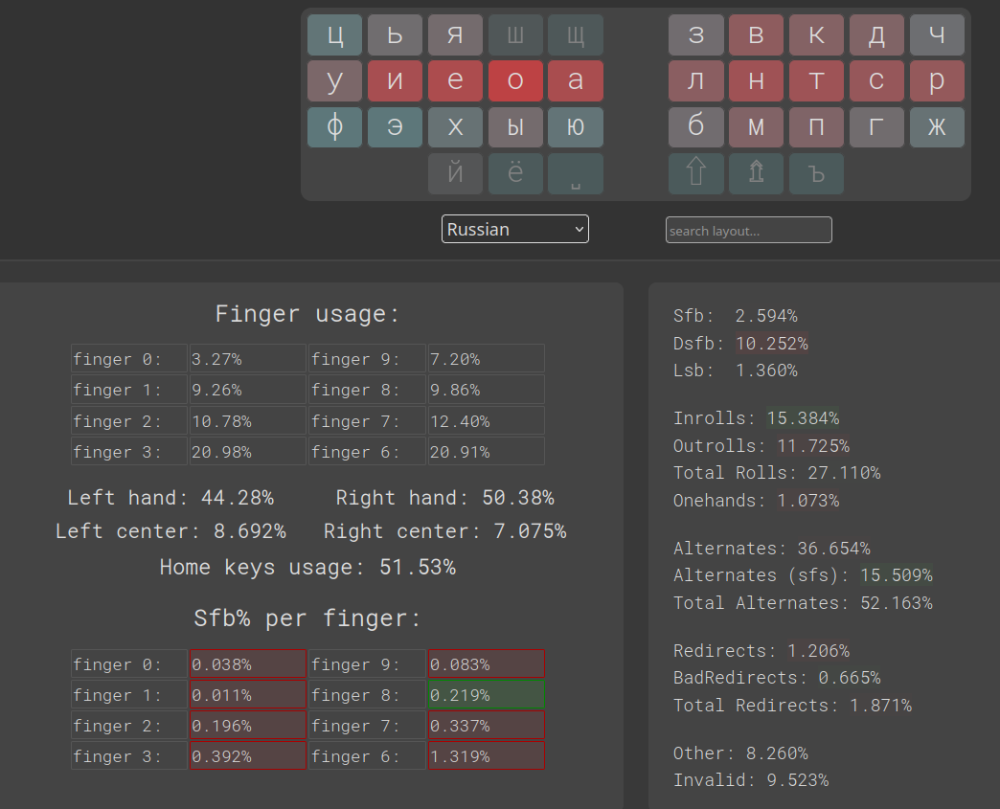
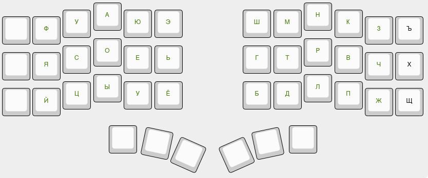
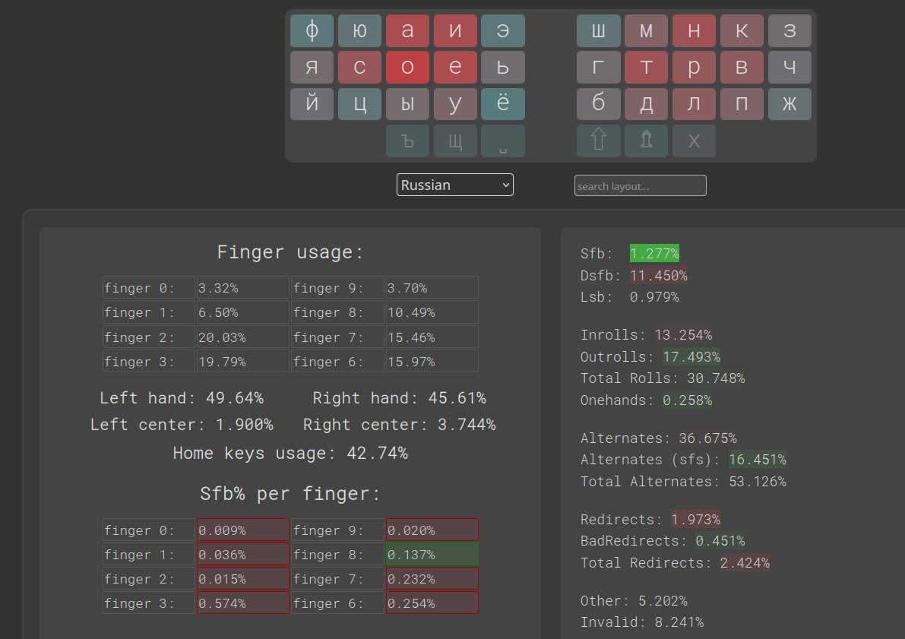

#Шаманка

Альтернативная русская раскладка для раздельных клавиатур с вынесенной в тамб-кластер альфой, высокими чередованиями, низкими sfb и пониженной нагрузкой на мизинцы.

**Shamanka** is alternative Russian layout for split keyboards featuring thumb-cluster alpha key, high alternation, low SFBs and reduced pinky load

```
ъфуаюэ  шмнкзх
 яиое.  гтрвчц
 йыь,ё  бдлпжщ
         с
```


##Рекомендации и соображения
Частотность буквы «Ё», при её постоянном использовании, сопоставима с частотностью буквы «Ю», по этой причине я вынес её в основной блок 3x5. Если вы не используете «ё» в повседневном наборе, можете смело выбросить её за пределы блока, заменив на «-» (либо поставив «-» на место «Э», а «Э» — на место «Ё»). Настоятельно не рекомендую ставить на это место согласные, включая «Ъ», так как это может существенно сказаться на удобстве набора, приведя к появлению неудобных SFB.

Для ещё большего понижения нагрузки на мизинцы также рекомендую использовать раскладку в режиме блока 3x5, убрав «лишние» альфы с мизинцев на комбо или в слой. Я использую комбо и моя повседневная раскладка выглядит так:



*(«Э» вынесена на комбо в пользу «-» из соображений личного удобства и может не дать ощутимых преимуществ.)*

Я использую «Шаманку» в паре с [Nordrassil](https://github.com/empressabyss/nordrassil) в качестве английской раскладки и в значительной мере вдохновлялся ею при разработке.

«Шаманка» проектировалась с расчётом на высокие чередования и комфорт пальцев. Возможно, она не обладает выдающимися катабельными характеристиками. (Если для вас в первую очередь важны перекаты и скорость, чуть позже я приведу примеры альтернативных русских раскладок, ориентированных на роллы в большей степени.)

##Статистика и сравнение


Шаманка


Йцукен


Диктор

##Версия без тамб-альфы

Тем, кому не нужны знаки препинания в основном блоке и не привычна вынесенная тамб-альфа, могу предложить следующий вариант адаптации:

```
ъфюаиэ  шмнкзх
 ясоеь  гтрвчщ
 йцыуё  бдлпж
```





**Важное примечание:** я не тестировал эту версию на рабочих скоростях, однако на скоростях в районе 25−30wpm она ощущалась достаточно неплохо. На стандартных клавиатурах она не тестировалась мной вовсе, поэтому я не могу дать никаких рекомендаций относительно её использования в этом качестве, однако могу предположить, что использовать её вполне возможно.

##Другие альтернативные русские раскладки

[Vestnik](https://github.com/nxtk/vestnik-layout)

[Статика](https://github.com/mohoaz1348-rgb/statica)

*список дополню в ближайшее время*